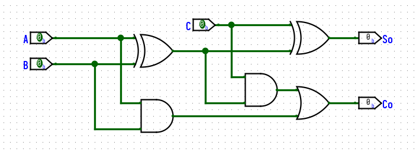
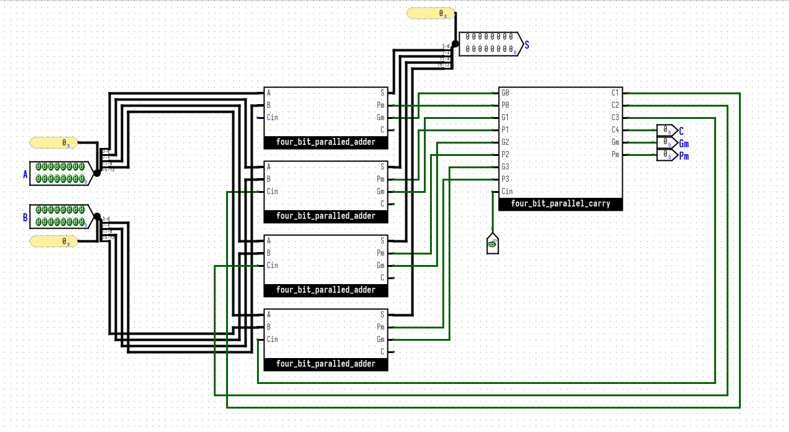
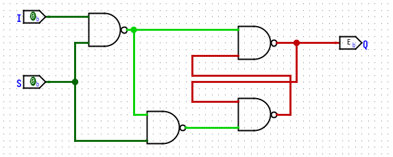
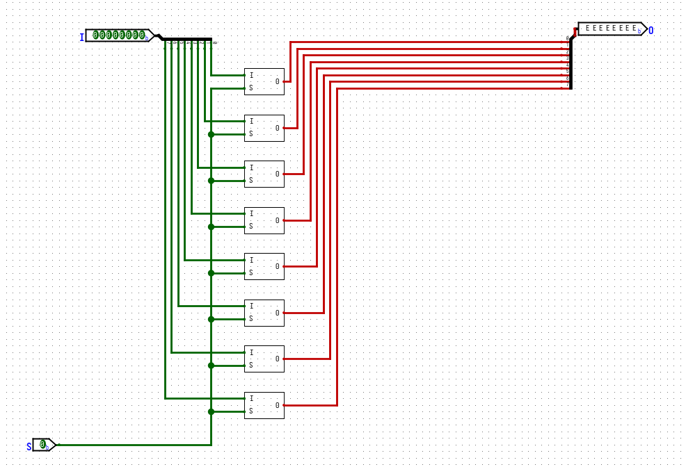
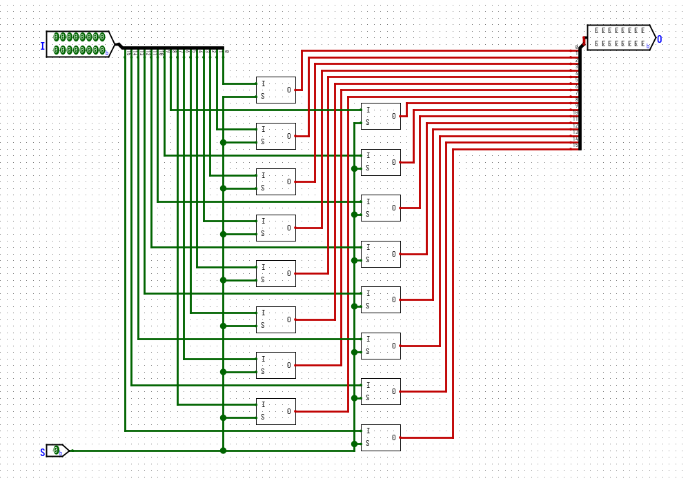

## Half Adder

和数：

进位：

|  A  |  B  | S0  | C0  |
| :-: | :-: | :-: | :-: |
|  0  |  0  |  0  |  0  |
|  1  |  0  |  1  |  0  |
|  0  |  1  |  1  |  0  |
|  1  |  1  |  0  |  1  |

## Full Adder

和数：

进位：

进位也可用一个异或门来代替或门对其中两个输入信号进行求和

| $C_i$ |  A  |  B  | $S_i$ | $C_i$ |
| :---: | :-: | :-: | :---: | :---: |
|   0   |  0  |  0  |   0   |   0   |
|   1   |  0  |  0  |   1   |   0   |
|   0   |  1  |  0  |   1   |   0   |
|   1   |  1  |  0  |   0   |   1   |
|   0   |  0  |  1  |   1   |   0   |
|   1   |  0  |  1  |   0   |   1   |
|   0   |  1  |  1  |   0   |   1   |
|   1   |  1  |  1  |   1   |   1   |

## Four Bit Adder

## Carry-Lookahead Adders

### 4-bit

### 16-bit

## 16-bit logic gate

## Shifter

## Mem

### 1-bit

### 8-bit

### 16-bit

## Enabler

## Register

## Compare

### 1-bit

### 16-bit

